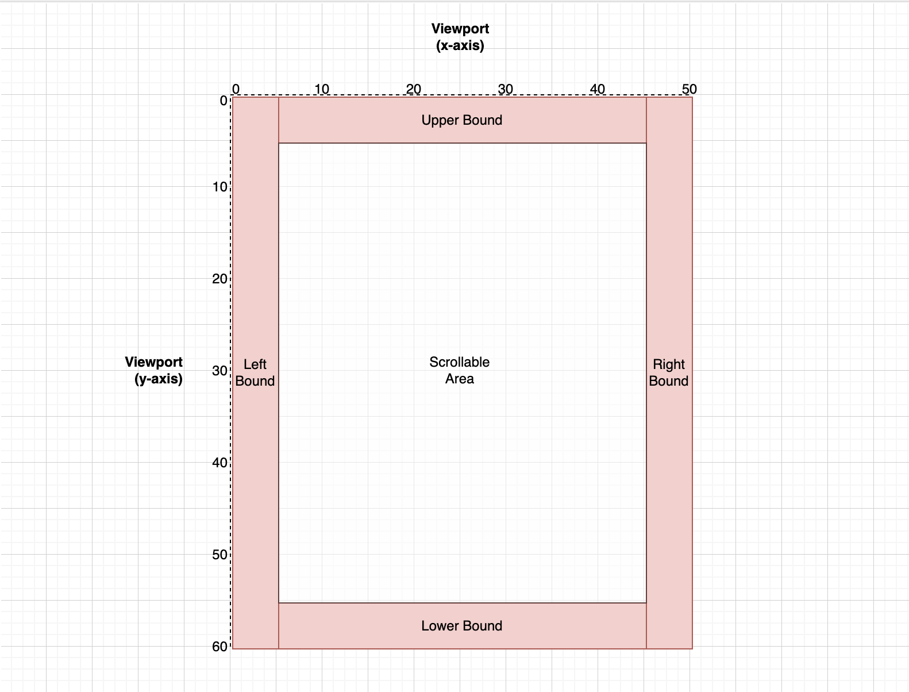
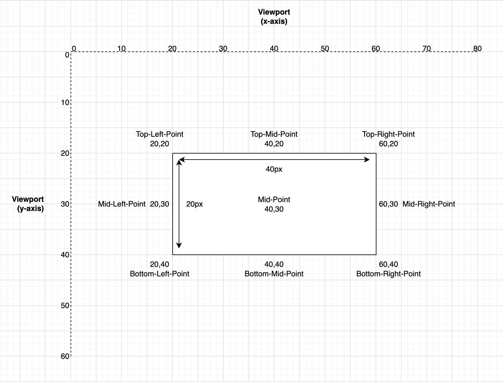

# Enhanced Swipe Actions Library
The purpose of this library is to provide more robust and useful swiping/scrolling functionality for Appium mobile automation.  
It currently only targets use with Android, and has not been tested against iOS.

## To-Do
- Publish as a library

## Available Methods
```python
swipe_up()
swipe_down()
swipe_left()
swipe_right()
swipe_next()
swipe_previous()
swipe_on_element()
swipe_element_into_view()
```

## Demo and Example Usage


```python
class TestDemo(TestCore):
    def test_element_search(self):
        swipe = SwipeActions(self.driver)
        self.driver.find_element(
            by=AppiumBy.ANDROID_UIAUTOMATOR,
            value='new UiSelector().description("Today")',
        )
        self.driver.find_element(
            by=AppiumBy.ANDROID_UIAUTOMATOR,
            value='new UiSelector().className("android.widget.Button").instance(3)',
        ).click()
        swipe.swipe_element_into_view(
            AppiumBy.ANDROID_UIAUTOMATOR,
            'new UiSelector().descriptionContains("Day planted")',
            SeekDirection.DOWN,
        )
```

## Defining a Scrollable Region
This library divides the viewport into four bounds: upper, lower, left, and right. The default values can be overwritten.  
Using these bounds, we then define a 'scrollable region'. We can then perform our scroll/swipe actions within this space.  
The impetus for this is to recreate scrolling/swiping behaviour more similar to a user and avoid hardcoding co-ordinates.  
Additionally, it avoids the automation attempting to perform actions on top of elements (such as headers or footers).  


## Defining Element Points
The importance of dynamically generating 'points' of an element to interact with allows us to account for re-sizing under a number of conditions (such as different devices/resolutions).

For the purpose of this library, we are only concered with two attributes of an element: position and size.  
The element's co-ordinates within the viewport is considered the top-left-point.

We can then use the element size to determine where it occupies relative to the view-port position.


```python
element_top_left_point      = element.location["x"], element.location["y"]
element_top_mid_point       = element.location["x"] + (element.size["width"] // 2), element.location["y"]
element_top_right_point     = element.location["x"] + element.size["width"], element.location["y"]

element_left_mid_point      = element.location["x"], element.location["y"] + (element.size["height"] // 2)
element_mid_point           = element.location["x"] + (element.size["width"] // 2), element.location["y"] + (element.size["height"] // 2)
element_right_mid_point     = element.location["x"] + element.size["width"], element.location["y"] + (element.size["height"] // 2)

element_bottom_left_point   = element.location["x"], element.location["y"] + element.size["height"]
element_bottom_mid_point    = element.location["x"] + (element.size["width"] // 2), element.location["y"] + element.size["height"]
element_bottom_right_point  = element.location["x"] + element.size["width"], element.location["y"] + element.size["height"]
```
Using the example element from the image, the above code would output the following:  
> Top-Left-Point:  (20, 20)  
> Top-Mid-Point:  (40, 20)  
> Top-Right-Point:  (60, 20)
> 
> Left-Mid-Point:  (20, 30)  
> Mid-Point:  (40, 30)  
> Right-Mid-Point:  (60, 30)
> 
> Bottom-Left-Point:  (20, 40)  
> Bottom-Mid-Point:  (40, 40)  
> Bottom-Right-Point:  (60, 40)

An example of this is available here: [demo/calc_coordinates.py](demo/calc_coordinates.py)

## Notes
### Swipe Element Into View
The method `swipe_element_into_view()` contains the helper `_probe_for_element()`.  
This is because when the element is not loaded into the DOM yet or the driver context is NATIVE - it will not be able to locate the element.  
It will instead start calling `perform_navigation_partial_()` and seek the element for a set number of attempts.  
This can be set/overwritten when initialising the class with the `**kwargs("probe_attempts")`.

### Wait/Expected Conditions
The library will not wait for the elements to be visible before interacting with them (such as `swipe_on_element()`).  
Ensure you implement this yourself.